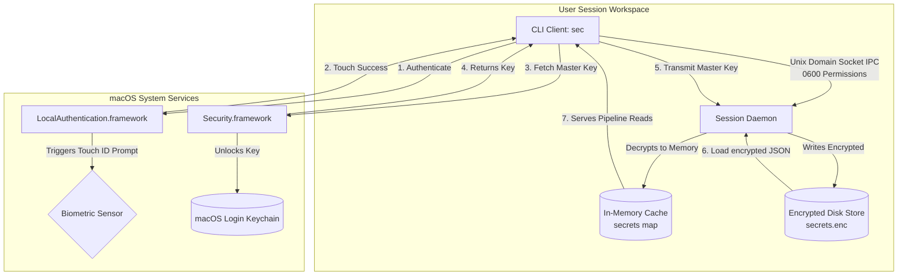
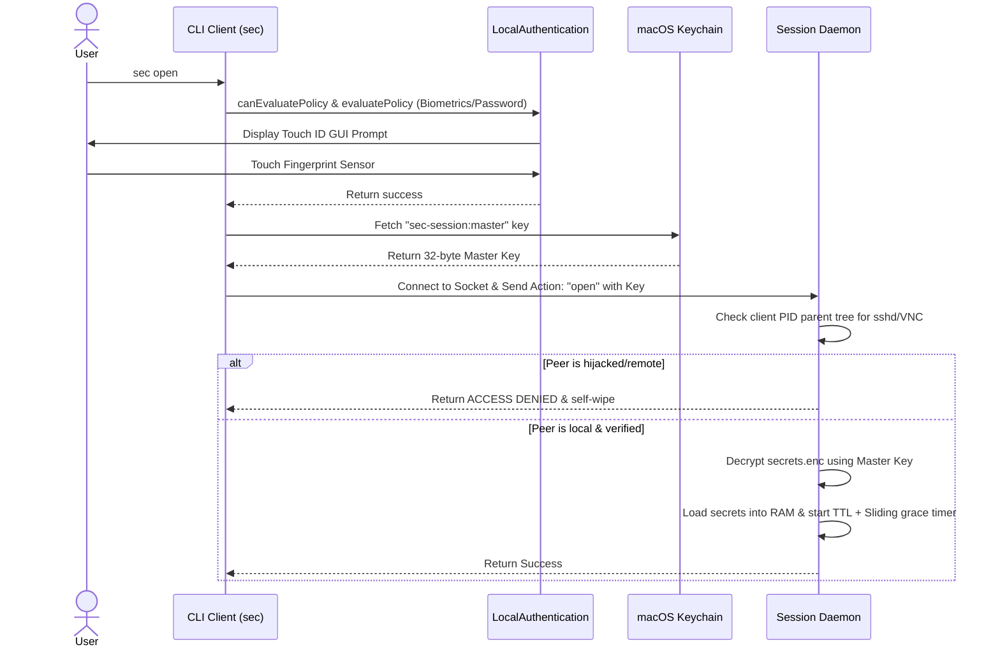
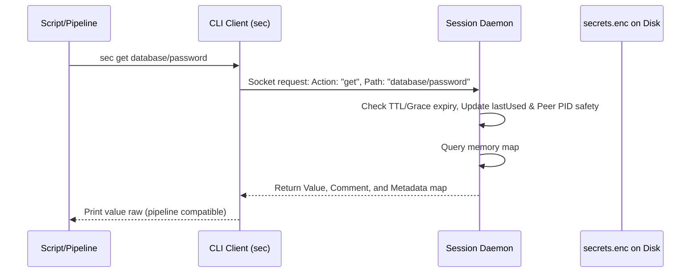

# Enclave Session Agent (`sec`) - Technical Design Documentation

This document describes the design, security architecture, process lifecycle, and threat mitigation models for the `sec` Enclave Session Agent.

---

## 1. System Architecture Overview

The system consists of a CLI client and a memory-isolated background daemon interacting with native macOS frameworks and local file structures.



---

## 2. Threat Model & Security Mitigations

### 2.1. The Target Threats
1.  **Remote SSH/Terminal Hijacking**: An attacker gains shell access to the user account (e.g. via compromised keys or shell backdoor) and executes scripts to steal local env secrets.
2.  **Corporate Admin/MDM Takeover**: An administrator with system/root privileges attempts to inspect the workspace files or attach a debugger to running pipeline utilities to read memory secrets.
3.  **Physical Device Seizure / Loss**: The laptop is lost or stolen, and a thief gains access to raw file structures.

### 2.2. Mitigations Matrix

| Threat Vector | Mitigation Strategy | Implementation Details |
| :--- | :--- | :--- |
| **Remote Session Hijack** | Active ancestry inspection & socket hardening | The daemon walks the peer connection PID's parent process tree. If any parent name contains `sshd`, or if screensharing/VNC (`screensharingd`) is running, the memory cache is immediately wiped and locked. |
| **Admin Root Memory Dump** | Kernel-level process isolation | Compiling the Go daemon with **Hardened Runtime** and omitting the debugging entitlement (`get-task-allow`). Under macOS System Integrity Protection (SIP), the kernel blocks root-level processes from calling `task_for_pid` or attaching debuggers. |
| **Ad-Hoc Entitlement Bypass** | Segregated biometrics & login keychain | Bypasses macOS `-34018` errors on ad-hoc builds by separating the biometric check (native `LocalAuthentication` prompt) from standard Keychain read/write access (using `kSecAttrAccessibleWhenUnlockedThisDeviceOnly`). |
| **Physical Data Theft** | AES-256 GCM encryption | The local secrets storage file (`secrets.enc`) is fully encrypted using AES-GCM. The decryption key resides exclusively in the Secure Enclave-backed macOS Keychain. |

---

## 3. Detailed Data Flow Lifecycle

### 3.1. Session Unlocking (`sec open`)


### 3.2. Secret Read/Write IPC (`sec get`/`sec set`)


---

## 4. Database Data Model

The secrets database is stored at `~/.config/sec/secrets.enc` as an encrypted JSON blob. The structure maps string paths to structured `SecretEntry` structures:

### 4.1. Struct Definition (Go)
```go
type SecretEntry struct {
    Value    string            `json:"value"`
    Comment  string            `json:"comment,omitempty"`
    Metadata map[string]string `json:"metadata,omitempty"`
}

type EncryptedStore struct {
    Secrets map[string]SecretEntry `json:"secrets"`
}
```

### 4.2. JSON Representation (Decrypted)
```json
{
  "secrets": {
    "database/prod/password": {
      "value": "my-ultra-secure-pass",
      "comment": "Production database root password",
      "metadata": {
        "env": "prod",
        "owner": "devops-team",
        "rotation-period": "90"
      }
    }
  }
}
```

---

## 5. KeePassXC Backup Translation

When performing `sec backup backup.kdbx`, the secrets are translated into standard KDBX XML fields:

```
[ sec SecretEntry ]                     [ KeePassXC Entry ]
┌─────────────────────────┐             ┌─────────────────────────┐
│ Path: "api/stripe/key"  │────────────▶│ Title: "api/stripe/key" │
├─────────────────────────┤             ├─────────────────────────┤
│ Value: "sk_live_..."    │────────────▶│ Password: "sk_live_..." │
├─────────────────────────┤             ├─────────────────────────┤
│ Comment: "Billing API"  │────────────▶│ Notes: "Billing API"    │
├─────────────────────────┤             ├─────────────────────────┤
│ Metadata:               │             │ Custom String Fields:   │
│   "env": "production"   │────────────▶│   "env": "production"   │
│   "owner": "billing"    │────────────▶│   "owner": "billing"    │
└─────────────────────────┘             └─────────────────────────┘
```

---

## 6. Future Portability Roadmap

This roadmap outlines potential designs for porting the `sec` utility to other operating systems. These items are unscheduled and carry no priority.

### 6.1. Windows Port
*   **Biometrics**: Bind to the **Windows Biometric Framework (WBF)** APIs in `winbio.dll` (utilizing standard Windows Hello prompts).
*   **Keychain**: Encrypt the master key using the **Data Protection API (DPAPI)** and store the ciphertext in the Windows Registry or Credential Manager.
*   **Anti-Hijacking**: Walk parent processes using Windows Toolhelp32 snapshots to block connections coming from `sshd.exe` or Remote Desktop binaries (`rdpclip.exe`).

### 6.2. Linux Port
*   **Biometrics**: Query the **fprintd** service via D-Bus (`net.reactivated.Fprint`) or start a native PAM transaction (`pam_fprintd.so`).
*   **Keychain**: Access **libsecret** (GNOME Keyring / KWallet) over D-Bus, falling back to GPG-encrypted local files if running in headless server environments.
*   **Anti-Hijacking**: Walk `/proc/<PID>/` ancestry tree and inspect `/proc/<parent_PID>/environ` for SSH socket variables.

### 6.3. Post-Quantum Cryptography (PQC) & Offline Sharing
To expand the utility to support secure, offline secret sharing between different users (e.g. encrypting a credential block to send to a teammate), the roadmap targets:
*   **Cryptographic Engine**: Implement a hybrid Key Encapsulation Mechanism combining classical **X25519** elliptic curves with post-quantum **ML-KEM-1024** (formerly Kyber-1024) utilizing Cloudflare's `circl` Go library.
*   **Symmetric vs. Asymmetric Separation**:
    *   **At-Rest (Local Database)**: Remains encrypted symmetrically via **AES-256 GCM**. Symmetric ciphers with 256-bit keys are already quantum-resistant because Grover's algorithm only reduces the search entropy to a still-unbreakable 128 bits.
    *   **In-Transit (Secret Transport Envelope)**: Uses the hybrid asymmetric KEM scheme. Ephemeral symmetric database keys are wrapped inside a hybrid envelope so that only the recipient's post-quantum private key can open them.
*   **The "Harvest Now, Decrypt Later" Threat Mitigation**: This ensures that even if an adversary intercepts and records the encrypted sharing payload today, they cannot decrypt it in the future when cryptographically relevant quantum computers become available.
*   **Low-Complexity Implementation Strategy**:
    *   **No Infrastructure Overhead**: Avoids complex Public Key Infrastructures (PKI) or servers. Public keys are exchanged peer-to-peer (like Git SSH keys).
    *   **Database-Backed Key Storage**: Instead of designing a separate keyring, the user's generated sharing private key is stored as a secret entry inside their local `secrets.enc` database. This inherits the Secure Enclave and Touch ID protection for free.
    *   **Base64 Transport String**: The command `sec share <path> <recipient-pubkey>` yields a single base64 string containing the encapsulated header and encrypted payload, which can be copied and pasted over Slack or email. The command `sec receive <base64>` imports it directly.
*   **User Group Expansion**: Implementing native, CPU-efficient PQC-ready sharing could attract cryptographically-conscious developers, security-critical DevOps teams, and enterprise security departments seeking to build offline-first workflows.

### 6.4. KeePassXC Compatible Time Metadata
To align fully with the native KeePassXC schema and prevent metadata loss during migrations:
*   **Data Fields**: Add `created`, `last_modified`, and `expires` (optional) timestamps to the `SecretEntry` data structure.
*   **Automatic Handshakes**: The background daemon will automatically manage these:
    *   New secrets receive `created = time.Now()` and `last_modified = time.Now()`.
    *   Updated secrets preserve `created` and set `last_modified = time.Now()`.
*   **1:1 KDBX Syncing**: Map these fields directly to KeePassXC's native `Times.CreationTime`, `Times.LastModificationTime`, and `Times.ExpiryTime` XML tags during backups and restorations.

### 6.5. Session Vault Recycle Bin (History Guard)
To safeguard developers from accidental data loss or overwrites:
*   **Internal Archiving**: Instead of permanently deleting or overwriting a secret, the daemon moves the old entry version into an internal virtual namespace: `archive/<timestamp>_<original_path>`.
*   **Management Utilities**:
    *   `sec restore-path archive/<path>`: Recovers the archived secret back into the active database.
    *   `sec empty-trash`: Permanently purges the `archive/` prefix entries from the encrypted store.

### 6.6. Environment Injection & Decoupling CLI Features
To simplify integration into scripting pipelines and remove tool lock-in:
*   **Process Wrapper (`sec run`)**: Execute target commands directly with secrets injected as temporary environment variables, avoiding permanent terminal environment persistence:
    `sec run --profile <profile> -- <command>`
*   **Environment Exporter (`sec env`)**: Output POSIX-compliant shell exports for a specific namespace, facilitating one-command shell overrides:
    `eval $(sec env <namespace>)`
*   **Plaintext Database Exporter (`sec export`)**: Output the decrypted database structure in standard formats to support frictionless migration to alternative managers (e.g. AWS Secrets Manager, OVH Barbican, Doppler):
    `sec export --format <env|json>`

### 6.7. KeePassXC .kdbx Mirroring & Dynamic Sync
To avoid custom database formats and allow developers to use graphical password managers (like KeePassXC or Strongbox on macOS/iOS) interchangeably with the `sec` CLI:
*   **Direct Key Mapping**: Mount a standard `.kdbx` file directly as the database store. The master password of the `.kdbx` file is mapped directly to the 32-byte cryptographically random master key stored securely in the macOS Keychain.
*   **Dynamic Mirroring**: The daemon monitors changes to the `.kdbx` file and dynamically merges writes between CLI commands (`sec set`) and GUI edits.

### 6.8. Local Cloud-API Endpoint Emulation (Optional Feature)
To allow developers to write pure cloud SDK code locally without lock-in:
*   **Endpoint Mocking**: Spawn a local HTTP listener emulating AWS Secrets Manager or GCP Secrets Manager APIs.
*   **Frictionless local development**: The application uses standard cloud APIs (e.g. `aws secretsmanager get-secret-value`), but locally communicates with `sec` loopback listeners.

### 6.9. SSH-Agent Socket Protocol Emulation (Optional Feature)
To route standard SSH connections securely:
*   **SSH-Agent Bridge**: Emulate the POSIX `SSH_AUTH_SOCK` protocol, prompting Touch ID verification when executing `ssh` or `git` remote operations.

### 6.10. Browser Extension JSON-RPC API Socket (Disabled by Default)
To support autofilling administrative credentials directly from the memory cache:
*   **Extension Socket**: Implement the KeePassXC-Browser websocket protocol to allow browser extensions to retrieve logins.
*   **Security Constraint**: Must be **disabled by default** to mitigate risks of remote browser hijacking. Requires explicit opt-in confirmation by the developer.

### 6.11. Prefix/Path-Specific Biometric Double-Locking (High-Value Keys)
To protect extremely sensitive credentials (such as production root keys) from background session reuse:
*   **Double-Lock Metadata**: Support setting a `double_lock` flag inside the secret entry itself (or configured by path prefix patterns like `prod/*`).
*   **Active Biometrics Override**: Whenever a command requests a double-locked secret path (e.g. `sec get prod/db/root`), the daemon ignores the active session cache and forces an active biometrics Touch ID / user presence verification prompt before returning the value.
*   **Granular Friction**: Keeps standard dev/test credentials frictionless while guaranteeing physical user presence validation for high-impact actions.

---

## 7. Multi-Project Separation Architecture: Namespaces vs Profiles

To organize secrets across different projects or client engagements, `sec` supports both logical and physical isolation boundaries.

### 7.1. Option 1: Namespace-based Separation (Single Database)
*   **Mechanism**: A single encrypted `secrets.enc` file on disk and a single active background daemon. Projects are separated using virtual path prefixes:
    *   `project-a/prod/api-key`
    *   `project-b/dev/db-password`
*   **Trade-off Advice**: 
    *   *Choose when*: You need low-friction, rapid context switching between multiple projects during your workday. You only authorize Touch ID once, and all local terminal scripts retrieve their respective secrets instantly.
    *   *Security limitation*: If a process or script running under your user account is compromised, it can query the daemon for secrets belonging to other projects on the same machine.

### 7.2. Option 2: Profile-based Separation (Multiple Databases)
*   **Mechanism**: Distinct databases on disk (e.g. `~/.config/sec/project-a.enc`) and isolated sockets (e.g. `~/.config/sec/project-a.sock`), loaded via `sec open --profile project-a`.
*   **Trade-off Advice**:
    *   *Choose when*: You have strict isolation requirements (e.g., separating freelance client credentials from corporate workspace credentials).
    *   *Security advantage*: Complete cryptographic segregation. A compromise in Project A cannot access Project B's secrets because they are locked in a different file and managed by a separate daemon process.
    *   *Usability limitation*: You must trigger and approve separate Touch ID prompts for each profile you unlock.

---

## 8. Concurrency & Write Thread-Safety

To ensure `sec` can handle concurrent pipeline calls safely on a single machine:

```
[ Parallel CLI Queries ]  ───▶  [ Unix Domain Socket ]  ───▶  [ daemon.go ]
(Multiple terminal tabs)       (Connection Queue)             (Accept Loop)
                                                                    │
                                                                    ▼
                                                            d.handleConnection()
                                                                    │
                                                           d.mu.Lock() [Mutex]
                                                                    │
                                                                    ▼
                                                         [ Serialized Exec ]
                                                         - reads / writes
                                                         - SaveStore() to disk
                                                                    │
                                                           d.mu.Unlock()
```

### 8.1. Daemon-Level Serialization (The Broker Pattern)
The `sec daemon` acts as a serialized gatekeeper to the database:
1.  **Queueing**: When multiple scripts execute `sec set` or `sec get` concurrently, the Unix socket accepts connections and spawns lightweight goroutines.
2.  **Global Mutex Lock**: The `d.handleConnection` routine instantly locks the daemon's internal mutex (`d.mu.Lock()`). This forces all concurrent actions to serialize.
3.  **Transactional Saves**: For write actions (`set` and `restore`), the daemon updates the in-memory map and persists the ciphertext to disk using `store.SaveStore` *while holding the lock*. 
4.  **Guarantees**:
    *   **No Dirty Reads**: A read query cannot run while a write operation is updating the map or disk file.
    *   **No Write Race Conditions**: Concurrent writes are executed sequentially. The last write will win cleanly without corrupting the underlying encrypted file.
    *   **Non-Blocking Reads**: Read requests are extremely fast (sub-millisecond memory lookups), ensuring no performance locks in high-throughput pipelines.

---

## 9. Granular Attribute Updates and Deletion

To operate as a structured secrets vault, `sec` supports querying, modifying, and deleting individual attributes (values, comments, metadata keys) or whole database entries in one transaction.

### 9.1. Granular Retrieval (`sec get`)
*   **Default (Raw Value)**: `sec get <path>` prints the raw secret value (retaining shell pipeline compatibility).
*   **Selective Attributes**: 
    *   `sec get <path> --comment` queries the comment only.
    *   `sec get <path> --meta <key>` queries a specific metadata value.
*   **Whole Entry (JSON Blob)**: `sec get <path> --json` dumps the complete entry payload (including value, comment, metadata map, and timestamps).

### 9.2. Granular Updates (`sec set`)
To update attributes without overwriting others, the `<value>` parameter becomes optional if a modifier flag is present:
*   **Partial Updates**:
    *   `sec set <path> --comment "New description"` updates only the comment, preserving the value and existing metadata.
    *   `sec set <path> --meta owner=billing` adds/updates only the `owner` metadata key, leaving other attributes intact.
*   **Whole Entry Overwrite**:
    *   `sec set <path> --json '{"value":"pass","comment":"notes","metadata":{"env":"dev"}}'` replaces the entire entry.
    *   Piped payloads like `cat secret.json | sec set <path> --json -` are supported.

### 9.3. Granular Deletion (`sec delete`)
A dedicated deletion subcommand `sec delete` handles both partial attribute wipes and complete secret removals:
*   **Delete Whole Secret**: `sec delete <path>` completely removes the path and its associated data structure from the store.
*   **Delete Comment**: `sec delete <path> --comment` clears the comment attribute, keeping the value and metadata.
*   **Delete Metadata Key**: `sec delete <path> --meta <key>` removes only the specified key from the metadata map, preserving all other keys and values.

